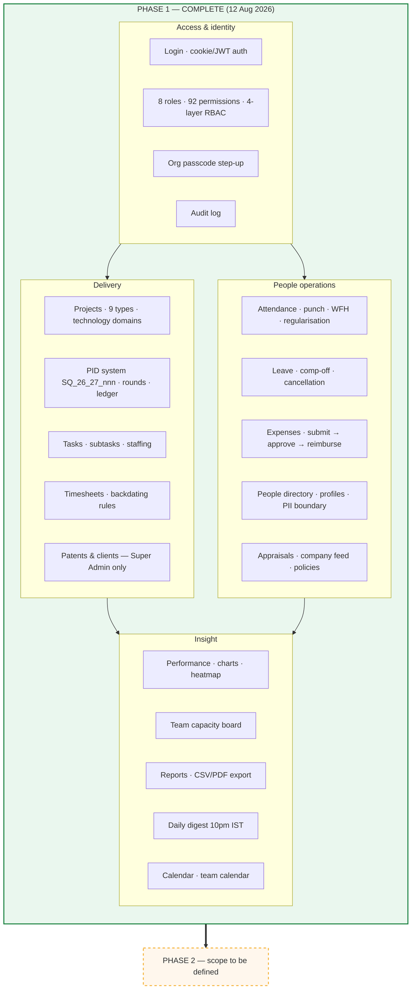
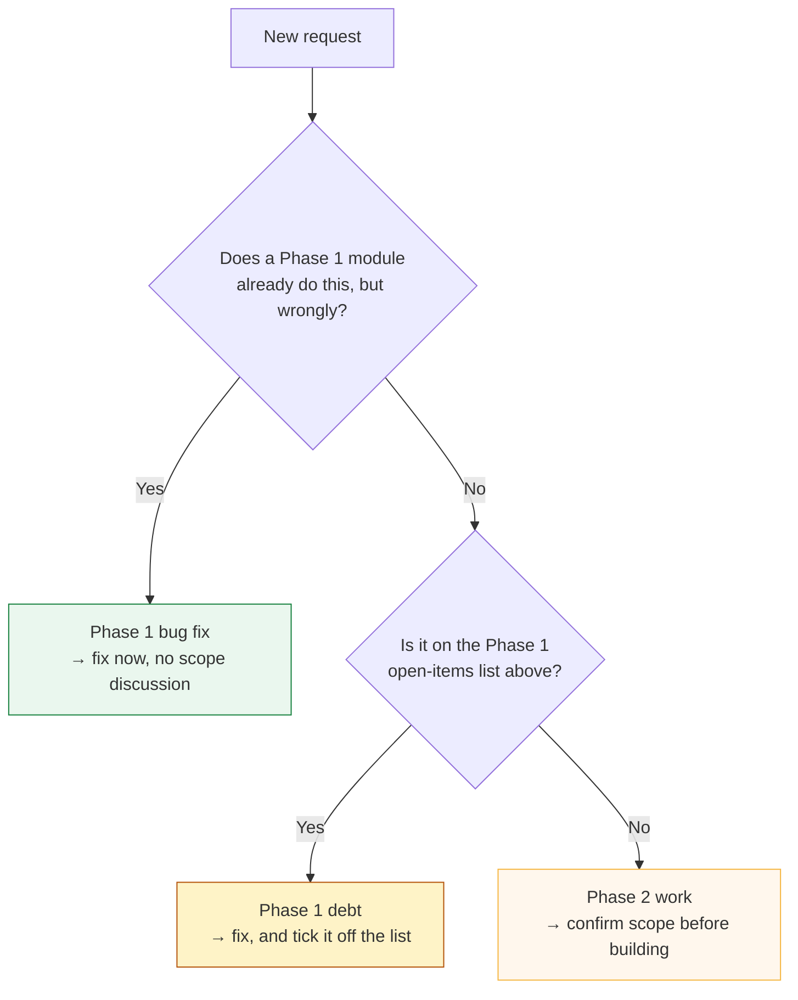

# Project phases — Squark Dashboard

> **Read this first.** It is the authority on which phase a piece of work belongs to.
> Phase 1 is closed. New work is Phase 2 unless it fixes something Phase 1 shipped broken.

| | Phase 1 | Phase 2 |
|---|---|---|
| **Status** | ✅ **COMPLETE** — closed 12 August 2026 | 🚧 **IN PROGRESS** — opened 12 August 2026 |
| **Scope** | Build and stabilise the internal platform | Clients and patents; then team spaces and the BD pipeline |
| **Live at** | https://217.76.59.244.sslip.io (Contabo) | same instance |
| **Reference** | `Squark-Dashboard-Phase-1-Guide.pdf` (22 sections) | — |

---

## Phase 1 — what was delivered

Twenty-two modules, all live and in use by the team. The user-facing description is
`Squark-Dashboard-Phase-1-Guide.pdf`; the one-page version is
`Squark-Dashboard-Phase-1-Summary.pdf` (both in the `pdash docs` folder).

### Deployment state at close of Phase 1

- Code: GitHub `main` — see `git log` for the head commit at time of reading.
- `regrant-roles` **has been run**; role totals are Super Admin 92 · Admin 90 · Manager 53 ·
  Senior Consultant 50 · HR 49 · Consultant 43 · SRA 43 · Employee 39.
- Roster is authoritative in `packages/db/prisma/roster-align-2026-08.ts` — 26 people, one role
  each. Designation and role are **separate facts**; neither is derived from the other.
- Verified working in the browser on the live system: expenses overview, daily digest send,
  task-status consistency, PID ledger, project creation, WFH punch placement, leave cancellation.

---

## Open items carried out of Phase 1

These are **known and unresolved**. They are Phase 1 debt, not Phase 2 features.

| Item | Why it matters |
|---|---|
| **No reporting lines** — `user_manager` is empty | Appraisals set `reviewerId` from the manager map, so the manager-review step cannot happen at all, and the org chart has nothing to draw |
| **No 2027 holidays** | From 1 Jan 2027 every holiday is treated as a working day — attendance marks people absent, capacity shows them available |
| **`hr@squarkip.com`** — shared HR account | Approves leave, reads personal details, manages users, with no attribution in the audit log |
| **No offboarding function** | Every departure is a manual edit; 25 FKs cascade off `user`, which once destroyed 83 timesheets |
| **No email transport** | Every notification is in-app only. Someone who does not log in never learns anything |
| **`ESCALATION_EMAIL` hardcoded** (`attendance.module.ts`) | One person's address routes regularisations; if they leave it fails silently |
| **5 permission rows** deleted from the matrix sheet, never actioned | `project.approve` is load-bearing for the digest and overdue alerts; the 4 `channel.*` are dead |
| **Task estimated hours optional** | "Alloted" on the PID ledger stays blank without them |
| **Location captured on every punch, kept forever** | Includes home coordinates on WFH punches; no retention policy (DPDP) |

The 50-question list for the Super Admin that produced most of these is in the conversation
record; the highest-value four are reporting lines, 2027 holidays, the shared HR account, and
whether WFH punches should capture location.

---

## Phase 2 — scope and rules

Phase 2 opened 12 August 2026 and is **still open**. Its scope has widened once (see part two);
widening it again is a decision to record here, not to assume.

### Which phase does a request belong to?

### Rules while Phase 2 is open

1. **Record the scope here** the moment it is agreed. A phase with no written scope grows
   until nobody can say whether it is finished.
   **And do not invent a phase number.** Only the user opens a phase. Work that does not fit the
   written scope is recorded as a new *part* of the open phase unless they say otherwise — the
   repo already carries three unrelated "Phase 3" commits, so a number on its own identifies
   nothing.
2. **Do not silently reopen Phase 1.** If Phase 2 work requires changing a Phase 1 module,
   note it in the Phase 2 section rather than editing the Phase 1 record — the Phase 1 record
   is what shipped, and it should stay true.
3. **Keep the deployment sequence.** Code → `regrant-roles` if the permission catalogue changed
   → `roster-align` if people changed. Migrations run automatically on API boot.
4. **The roster file is the authority on roles**, not the database and not job titles.

### Phase 2 scope

**Theme: clients and patents — identity, tagging, and a client ledger.** Agreed 12 Aug 2026.

Design decisions, already made. Do not re-open them; build against them.

| # | Decision |
|---|---|
| 1 | **Client codes are typed, with a suggested default derived from the name.** Built and tested — `apps/api/src/common/client-code.ts`, 62 assertions in `tools/client-code.spec.ts`. Codes are 2–5 chars, letters and digits, at least one letter. |
| 2 | **Keep `/patents` and the client ledger as separate screens.** Do not fold one into the other. |
| 3 | **Anyone who can edit a project can tag patents to it** — gate on project access, NOT `patent.manage`. No new permission: `patent.view` is already in everyone's basics. |
| 4 | **Archive and Remove are different actions.** Archive is reversible and needs no passcode. Remove is a real delete, Super-Admin + passcode, and is **refused when the client has patents or projects** — those must be archived instead. `Patent.clientId` cascades, so an unguarded delete destroys patent records and documents. |
| 5 | **The ledger carries financials**, derived from live project and timesheet data, with a Super-Admin override that supersedes the derived figure and records who changed it and when. The derived value stays visible beside the override. |

#### Build order

| # | Item | State |
|---|---|---|
| 0 | **Typed client codes** with a suggested default — `client-code.ts`, 62 assertions | ✅ built |
| 1 | **Archive + remove** — `archivedAt` on Client, dependency guard, passcode on remove | ✅ built |
| 2 | **Tagging after creation** — add/remove patents on an existing project | ✅ built |
| 3 | **Client ledger** — the screen, with derived financials | ✅ built |
| 4 | **Financial overrides** — stored and audited | ✅ built |
| 5 | **`formerHandles`** — retired patent IDs keep resolving after a code rename | ✅ built |

#### What each item turned into

1. **Archive + remove.** `Client.archivedAt`. Archive is reversible, passcode-free, and destroys
   nothing; an archived client accepts no new patents and drops out of the project patent picker,
   while every existing link stays exactly as it was. Remove became a **real delete**, refused
   while any patent or project still points at the client — counting soft-deleted patents too,
   because the cascade does not respect `deletedAt`.
2. **Tagging after creation.** `PUT /projects/:id/patents` takes the **complete set**, not a
   delta, so saving twice is idempotent. Gated on project access + `project.update` (not
   `patent.manage`). It keeps the one-client rule, refuses patents from an archived client, and
   writes the derived `Project.clientId` so the ledger reads a column that cannot go stale.
   **Judgement call worth knowing about:** a COMPLETED or CLOSED project is locked, matching every
   other project mutation — correcting a mistag there means reopening the project first. Say so if
   you would rather tagging stayed open on a settled matter.
3. **Client ledger.** `/client-ledger`, its own screen and its own controller. Everything is
   recomputed per read from live projects and timesheets — never stored, because a stored total
   drifts the first time someone edits a time entry. Per client: projects, patents, billable and
   non-billable hours, contributors, first/last activity; the detail panel lists the projects
   behind the total so a figure that looks wrong can be traced.
4. **Financial overrides.** `ClientLedgerOverride`, one row per client, holding stated billable
   hours and a monetary value with a note, `updatedBy` and `updatedAt`. **Note on the money:**
   nothing in this system records a rate, an agreed fee or an invoice, so no monetary figure can
   honestly be derived — the derived headline is billable *hours*, and the amount is stated or
   absent. The derived value is always returned beside the stated one. Clearing both deletes the
   row. Audited with old and new values.
5. **`formerHandles`.** `Patent.formerHandles String[]`, appended on a client-code rename and kept
   free of the live handle, so renaming back and forth leaves no self-reference or duplicates.
   Both patent pickers match on retired IDs, the portal shows them, and
   `GET /patents/resolve?handle=` answers "a client just quoted Pat_MLK_7 — what is that now?".

#### 6. Direct client picker — added after testing (12 Aug)

Testing exposed a hole. The client was **only** ever inferred from tagged patents, so a project
with no patents belonged to no client and its hours were **invisible in the ledger** — which is
every FTO study, landscape, advisory job, and any new client whose patents are not registered
yet. Three of five demo projects were in that state. Separately, `CreateProjectDto.clientId` was
declared, validated, and then **never read** by the service: a silent no-op.

The rule now: **tagged patents decide the client whenever there are any**; with none, the client
is named directly and is editable. Only one can be in force, so the two can never disagree.

- `clientId` on create is honoured — but only when no patents are tagged.
- `PUT /projects/:id/client` sets or clears it later; **refused while the project has patents.**
- `get()` falls back to the stored client when there is nothing to infer from, and returns
  `clientFromPatents` so the UI knows whether to show it locked or editable.
- Removing the last patent **keeps** the client rather than nulling it — "I tagged the wrong
  patent" is not "this is no longer that client's work", and wiping it would drop the project
  out of the ledger silently.
- Naming a client requires **`patent.manage`**, because a dropdown of client names is precisely
  the confidential fact this system protects. Everyone else attaches one indirectly by tagging a
  patent handle, which reveals nothing about who the client is.
- Archived clients are not offered, and are refused server-side.

#### 7. Handle-reuse collision — found by review, fixed (12 Aug)

Two halves of one defect, both about a patent ID coming to mean two different clients' patents.

- **A retired client code could be recycled.** Rename MLK and "MLK" looks free, so a new client
  could take it and mint its own `Pat_MLK_001` — the exact ID already printed on a report sent to
  the *first* client. Now refused, but only when IDs were actually issued under that code: a code
  typed by mistake and corrected before any patent existed stays reusable, and a client renaming
  **back** to its own former code still works.
- **`resolveHandle` was nondeterministic.** It asked for the live handle and the retired ones in a
  single `OR` with no ordering, so on legacy data carrying such a collision the database could
  return either row — answering a question about one client with another client's patent. Now
  two ordered queries: a live handle always wins, retired ones are the fallback (oldest first),
  and a genuinely ambiguous ID is reported as `ambiguous` rather than silently resolved.

#### 8. The four refinements — done (13 Aug), in order of harm

1. **Rounds now inherit their PID's patents.** `addRound` copied the client but not the patent
   links, so round 1 read "client from patents" (locked) while round 2 read as directly-set and
   editable — and editing it silently split **one PID across two clients**. Rounds now copy the
   links, so every round under a PID agrees about whose work it is.
2. **Unattributed hours are shown, not omitted.** Time logged inside the PID buffer (no project
   yet) or on a project with no client reached no client and simply vanished from the ledger —
   **2,560 hours in the demo data alone**. `GET /client-ledger/unattributed` totals them, split by
   reason, and the ledger carries them on a footer line. The table no longer reads as a complete
   picture of the firm's work while quietly omitting part of it.
3. **A stale override is flagged.** `derivedHoursWhenSet` snapshots the derived figure at the
   moment a statement is made, which is the only way to tell a deliberate write-down from a number
   the work has moved past: without it, "stated 1,980h · derived 2,500h" could be either. Drift of
   ≥ 8h (one working day) marks the statement stale, in the table and in the panel, with the
   figures and a prompt to restate. Migration `20260919090000_override_derived_snapshot`, additive.
4. **Archiving warns about live work.** `listClients` now returns `activeProjects`, and archiving a
   client with running projects asks first, naming how many.

#### Deployment notes for this phase

- **Four additive migrations**, all safe to run under the current build:
  `20260916090000_client_archive`, `20260917090000_client_ledger_override`,
  `20260918090000_patent_former_handles`, `20260919090000_override_derived_snapshot`.
- **No `regrant-roles` needed** — no new permission codes. The ledger reuses `patent.manage`;
  tagging reuses `project.update` + `patent.view`.
- New sidebar entry **Client Ledger**, gated on `patent.manage` (Super Admin).

#### State of the clients-and-patents work

All items **built, typechecked, unit-tested and verified end-to-end against a scratch database**
(seeded copy, API on :4011) — creating, archiving, restoring, the refusal paths, tagging round
trips, the ledger totals, the override lifecycle, and a three-way client-code rename. 91
assertions pass across `tools/client-code.spec.ts` and `tools/patent-search.spec.ts`.

Shipped as **PR #82**, branch `phase2-clients-patents-ledger`. Not merged.

---

## Phase 2, part two — team spaces and the BD pipeline

Agreed 13 August 2026, when the request was *"proceed on to the next one — other teams task
allocations, HR, Sales, BD team"*.

> **On the numbering.** This is deliberately **not** a new phase. It sits inside Phase 2, whose
> theme widened from "clients and patents" to "clients, and the parts of the firm that are not
> client delivery". A brief attempt to call it "Phase 3" was withdrawn: three earlier and
> completely unrelated commits already carry that label (`leave & attendance`, `TeamNest
> appraisals`, `Discuss voice clips`), so the number identifies nothing.

**Theme: work that is not client delivery.** Today every piece of work in this system is a client
project — enforced, not conventional: a Task cannot exist without a Project, every project type is
a patent-analysis type, and projects carry PIDs, clients, billability and client deadlines. So HR,
BD and Sales work has nowhere to live except a "General / Other" project sitting in the delivery
list. `Team`/`TeamMember` tables exist and are **completely empty**; `Department` is populated with
*delivery* departments only (Operations, Prosecution, Search & Analytics, Trademarks).

Decisions, already made. Do not re-open them; build against them.

| # | Decision |
|---|---|
| 1 | **Team spaces are a separate destination**, not a flavour of project. Own sidebar module, own boards, own task lists, own members — kept off the delivery spine (no PID, no client, not in delivery reports or either ledger). |
| 2 | **BD/Sales gets a full pipeline**, not just task allocation: deals with values and stages, activity history, reminders, conversion and win/loss reporting, forecasting. |
| 3 | **Non-delivery work counts in all three measurement modules** — timesheets (log time against it), capacity (it consumes the week), and performance (it counts toward the score). |

**Known tension to design around for decision 3:** timesheets resolve work through a PID, and
capacity and performance are computed from *project* tasks. Team work has no PID, so all three
need a second resolution path. This is the bulk of the remaining risk.

**Worth confirming before building the pipeline:** the roster is 26 people — roughly 24 delivery,
**one** Senior BD Executive, **one** HR Specialist, and **no Sales role at all**. A full CRM is a
large build for one BD desk. **Answered 13 Aug: the BD team is growing**, so the full pipeline is
the right build.

### Build order and state

| # | Slice | State |
|---|---|---|
| 1 | **Team spaces core** — spaces, members, board columns, tasks, sidebar destination | ✅ built |
| 2 | **Measurement integration** — timesheets, capacity, performance against team tasks | ✅ built |
| 3 | **BD pipeline** — deals, stages, activities, forecast + conversion reporting | ✅ built |
| 4 | **Permissions + regrant** | ✅ codes in; regrant needed at deploy |

**Roster question answered 13 Aug: the BD team is growing**, so the full pipeline is the right
build rather than a lighter lead tracker.

#### What slice 1 turned into

`Task` already knew nothing about projects — the link lives in a join table — so `team_task`
mirrors `project_task` and `Task` needed no change. A task in a space keeps assignees, subtasks,
comments, statuses and logged time for free. Access mirrors a project's: membership decides, with
a `team.manage` oversight bypass, so there is no second security model. Being in a space grants no
capability the person lacked — tasks still need `task.*`, columns `tasklist.*`.

Deliberately simpler than a project: no Gantt, no capacity tab, no issues, no PID. Moving a task
is a dropdown, not drag-and-drop — it works on a phone, is keyboard-reachable, and cannot lose a
card to a mis-drop.

#### What slice 3 turned into

A deal is **not** a project: `company` is free text, because most prospects never become clients
and a client record per conversation would fill the confidential portal with noise. The join is at
winning — a won deal mints or links the Client, after which its work flows through projects and
the client ledger. Minting still needs `patent.manage`.

Losing **requires** a reason; the aggregate ("why we lose") is the most actionable thing here.
Stage probabilities live in one file shared by board, forecast and validation, and the page states
plainly that they are conventions to be replaced with measured conversion once there is history.
Cycle time uses closed deals only. Mixed currencies are flagged rather than silently summed.

#### What slice 2 turned into

Far smaller than feared for two of the three. **Capacity and performance already counted team
tasks** — both query `Task` by *assignee* with no project filter — they simply arrived unlabelled,
because both read the project through `projectTasks` and a team task has none. So an HR person
looked booked with blank rows, and their internal hours vanished from "where did your time go",
making the breakdown not add up to its own total. Both now fall back to the space's name.

**Timesheets** was the real work. An entry reaches its context through `projectId`; a team task
has none, so the entry would carry a null `projectId` — which already means *"inside the
assign-the-PID-later buffer"*. Left that way, internal time would be chased forever for a PID it
can never have, and the client ledger's Unattributed line would count it as unattributed *client*
work, overstating the gap that figure exists to expose. `Timesheet.teamId` keeps the three states
apart: project set = client work · team set = internal · both null = genuinely awaiting a PID.
Internal time is forced non-billable — there is no client to bill.

`team.status` was dropped in the same migration: it overlapped `archivedAt`, nothing ever read it,
and the column that nothing reads is the one that ends up lying.

#### Still open

Nothing in the agreed scope. Both PRs await review and merge.

---

#### Deployment notes for the team-spaces + pipeline work

- **Three migrations**: `20260920090000_team_spaces` (additive; drops NOT NULL on
  `task_list.projectId` and adds composite FKs so a task cannot be filed into another owner's
  list), `20260921090000_bd_pipeline` (new `deal` + `deal_activity` tables), and
  `20260922090000_timesheet_team` (adds `timesheet.teamId`, drops the unused `team.status`).
- **`regrant-roles` IS REQUIRED** — four new codes: `team.view`, `team.manage`, `deal.view`,
  `deal.manage`. Unlike Phase 2, this cannot be skipped.
- Role totals after the change: Super Admin 96 · Admin 94 · Manager 57 · Senior Consultant 51 ·
  HR 51 · Consultant 44 · SRA 44 · Employee 40.
- The BD team needs `deal.view`/`deal.manage` granted via the matrix — the presets give them to
  Manager, Admin and Super Admin only, since the pipeline is commercial information.

---

*Last updated 16 August 2026 — Phase 2: clients/patents complete; team spaces, the BD pipeline
and measurement integration all built. Nothing in the agreed scope remains. No Phase 3 opened.*
