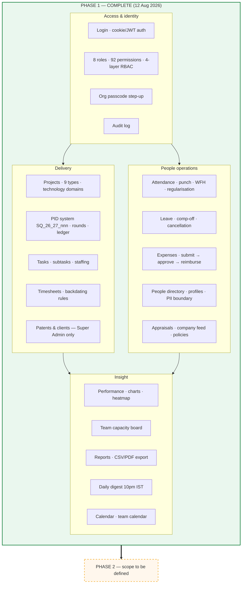
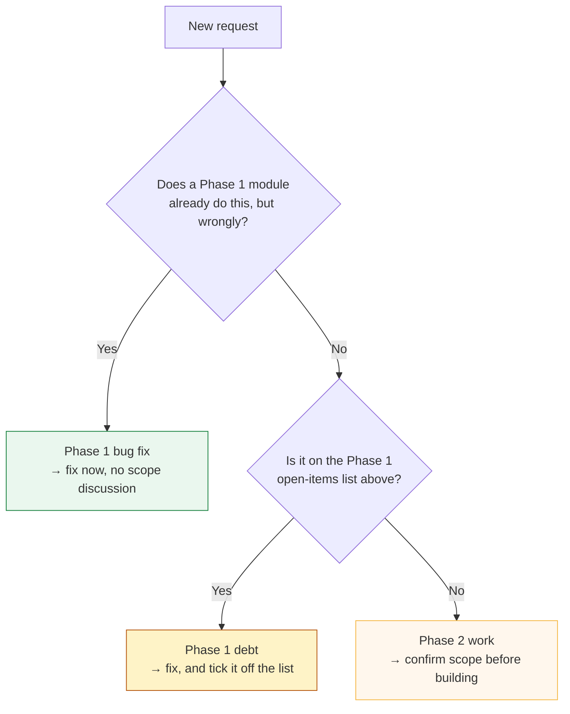

# Project phases — Squark Dashboard

> **Read this first.** It is the authority on which phase a piece of work belongs to.
> Phase 1 is closed. New work is Phase 2 unless it fixes something Phase 1 shipped broken.

| | Phase 1 | Phase 2 |
|---|---|---|
| **Status** | ✅ **COMPLETE** — closed 12 August 2026 | 🚧 **IN PROGRESS** — opened 12 August 2026 |
| **Scope** | Build and stabilise the internal platform | *Not yet defined — see "Defining Phase 2"* |
| **Live at** | https://217.76.59.244.sslip.io (Contabo) | same instance |
| **Reference** | `Squark-Dashboard-Phase-1-Guide.pdf` (22 sections) | — |

---

## Phase 1 — what was delivered

Twenty-two modules, all live and in use by the team. The user-facing description is
`Squark-Dashboard-Phase-1-Guide.pdf`; the one-page version is
`Squark-Dashboard-Phase-1-Summary.pdf` (both in the `pdash docs` folder).

### Deployment state at close of Phase 1

- Code: GitHub `main` — see `git log` for the head commit at time of reading.
- `regrant-roles` **has been run**; role totals are Super Admin 92 · Admin 90 · Manager 53 ·
  Senior Consultant 50 · HR 49 · Consultant 43 · SRA 43 · Employee 39.
- Roster is authoritative in `packages/db/prisma/roster-align-2026-08.ts` — 26 people, one role
  each. Designation and role are **separate facts**; neither is derived from the other.
- Verified working in the browser on the live system: expenses overview, daily digest send,
  task-status consistency, PID ledger, project creation, WFH punch placement, leave cancellation.

---

## Open items carried out of Phase 1

These are **known and unresolved**. They are Phase 1 debt, not Phase 2 features.

| Item | Why it matters |
|---|---|
| **No reporting lines** — `user_manager` is empty | Appraisals set `reviewerId` from the manager map, so the manager-review step cannot happen at all, and the org chart has nothing to draw |
| **No 2027 holidays** | From 1 Jan 2027 every holiday is treated as a working day — attendance marks people absent, capacity shows them available |
| **`hr@squarkip.com`** — shared HR account | Approves leave, reads personal details, manages users, with no attribution in the audit log |
| **No offboarding function** | Every departure is a manual edit; 25 FKs cascade off `user`, which once destroyed 83 timesheets |
| **No email transport** | Every notification is in-app only. Someone who does not log in never learns anything |
| **`ESCALATION_EMAIL` hardcoded** (`attendance.module.ts`) | One person's address routes regularisations; if they leave it fails silently |
| **5 permission rows** deleted from the matrix sheet, never actioned | `project.approve` is load-bearing for the digest and overdue alerts; the 4 `channel.*` are dead |
| **Task estimated hours optional** | "Alloted" on the PID ledger stays blank without them |
| **Location captured on every punch, kept forever** | Includes home coordinates on WFH punches; no retention policy (DPDP) |

The 50-question list for the Super Admin that produced most of these is in the conversation
record; the highest-value four are reporting lines, 2027 holidays, the shared HR account, and
whether WFH punches should capture location.

---

## Defining Phase 2

Phase 2 scope is **not yet set**. Until the user defines it, do not assume it.

### Which phase does a request belong to?

### Rules for Phase 2

1. **Record the scope here** the moment it is agreed. A phase with no written scope grows
   until nobody can say whether it is finished.
2. **Do not silently reopen Phase 1.** If Phase 2 work requires changing a Phase 1 module,
   note it in the Phase 2 section rather than editing the Phase 1 record — the Phase 1 record
   is what shipped, and it should stay true.
3. **Keep the deployment sequence.** Code → `regrant-roles` if the permission catalogue changed
   → `roster-align` if people changed. Migrations run automatically on API boot.
4. **The roster file is the authority on roles**, not the database and not job titles.

### Phase 2 scope

> _To be filled in when agreed. Leave this section as-is until then._

---

*Last updated 12 August 2026, when Phase 1 was closed and Phase 2 opened.*
